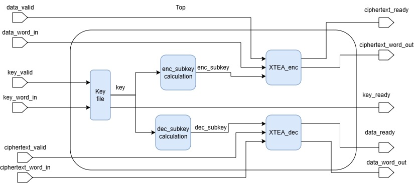
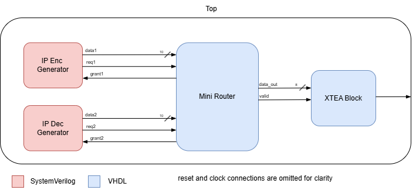

# Cryptography Development in FPGA

Implementation of a hardware-based cryptographic system using the eXtended Tiny Encryption Algorithm (XTEA), developed in VHDL and SystemVerilog and deployed on a Digilent Basys 3 FPGA board. The project was completed as part of a coursework for an *Electronic System Design with FPGAs* module. 

## Overview

This project consists of two parts:

### Part 1: XTEA-128 Hardware Implementation

Designed and developed a duplex XTEA implementation with independent encryption and decryption datapaths with shared key storage. This implementation supports 128-bit input data and key lengths, processing 32 XTEA rounds across 64 clock cycles.

The design was verified with an automated testbench that was provided as part of the coursework brief. 

#### Technical Details
 - Implemented independent subkey calculation modules for encryption and decryption, calculating subkeys one clock cycle before they are needed.
 - Designed finite state machines to control key loading, input data loading, round calculations, and output transmission.

### Part 2: Integrated Cryptographic System

Extended the XTEA implementation into a complete cryptography system with IP generators and an NoC router with routing based on encryption metadata for plaintext and ciphertext data streams.

This design was verified using an automated SystemVerilog testbench that tests every possible routing case for the NoC router.

#### Technical Details
 - Implemented priority-based arbitration for NoC router using two priority bits per input, with round-robin conflict resolution for equal priority requests.
 - Integrated encryption and decryption data generators using SystemVerilog alongside VHDL-based NoC router and cryptographic modules.

## Verification
 - Compared encryption and decryption outputs against known reference values.
 - Validated the complete XTEA calculation sequence across multiple input blocks and keys.
 - Tested router arbitration for single requests, differing priorities, equal-priority conflicts, and idle conditions.
 - Inspected simulation waveforms to verify FSM behaviour, data transfers, and output timing.
 - Deployed both designs onto the FPGA and validating ciphertext/plaintext through UART using a serial monitor.

## FPGA Implementation
 - Implemented UART communication to display encrypted/decrypted data on a host PC using a serial monitor.
 - Onboard LEDs used to display transmission was completed successfully.

## Implementation Results
|Metric|XTEA Implentation|Cryptographic System|
|---|---|---|
|FPGA Slice LUTs|1009|1016|
|FPGA Slice Registers|778|893|
|FPGA Slices|331|341|
|Worst Negative Slack (WNS)|+1.439ns|+3.068ns|

## Tools and Technologies
 - **HDLs:** VHDL, SystemVerilog
 - **Development Environment:** Vivado 2019.1
 - **Target Hardware:** Digilent Basys 3 FPGA
 - **Cryptographic Cipher:** XTEA (128-bit key implementation)
 - **Communication:** UART, RealTerm

## Repository Structure
 - `xtea/` - XTEA implementation, both simulation-only and FPGA implementations.
 - `cryptography_system/` - Cryptography system implementation, both simulation-only and FPGA implementations.
 - `images/` - Schematic images. 